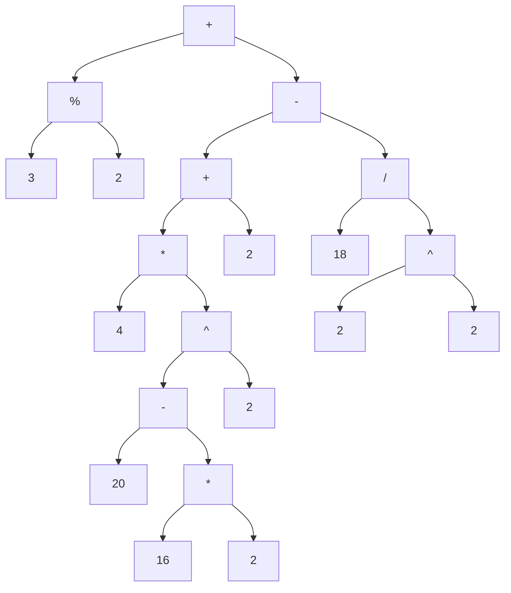

```mermaid
graph TD
    A["+"] --> B["%"]
    A --> C["-"]
    B --> D["3"]
    B --> E["2"]
    C --> F["+"]
    C --> G["/"]
    F --> H["*"]
    F --> I["2"]
    H --> J["4"]
    H --> K["^"]
    K --> L["-"]
    K --> M["2"]
    L --> N["20"]
    L --> O["*"]
    O --> P["16"]
    O --> Q["2"]
    G --> R["18"]
    G --> S["^"]
    S --> T["2"]
    S --> U["2"]
```

